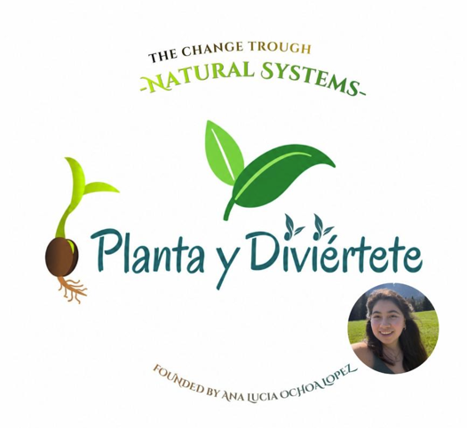

  

<h1 align="center">🌱 Learning From Nature</h1>

Biomimicry • Living Systems • Regenerative Design • Future Sustainable Technologies

---

Welcome to my interdisciplinary research and technical portfolio exploring how plants, ecosystems, and living systems can inspire future approaches to engineering, sustainability, and environmental innovation.

This repository documents academic projects, independent research, technical explorations, and long-term investigations developed throughout my journey in Environmental and Energy Systems Engineering.

---

## 🌍 Main Research Interests

* Biomimicry & Nature-Inspired Innovation
* Living Systems & Ecological Intelligence
* Regenerative Engineering
* Environmental Engineering
* Nature-Based Solutions
* Future Energy Systems
* Systems Thinking
* Human & Ecological Wellbeing
* Community Resilience
* Sustainable Technologies

---

## 🔬 Research Vision

Nature has spent billions of years developing solutions to challenges related to energy, adaptation, resilience, cooperation, and regeneration.

My research explores how humans can learn from these living systems to design technologies, products, and environmental solutions that contribute positively to both ecosystems and communities.

Rather than asking only how technology can become more efficient, I am interested in understanding how future systems can become more regenerative, adaptive, and integrated with the natural world.

This repository brings together ideas and projects connecting:

* 🌱 Plants & Living Systems
* ⚙️ Engineering & Technology
* ♻️ Regeneration & Sustainability
* 🌍 Ecology & Environmental Systems
* ⚡ Future Energy
* 🤝 Human Communities
* 🚀 Future Innovation

---

## 🌿 Long-Term Goal

To develop research, technologies, and regenerative systems inspired by nature that help strengthen both environmental and human wellbeing while contributing to a more resilient future.

---

## 📂 Repository Structure

- [ 🔬 Research](./research)
- [ 🌿 Technical-Models](./technical-models)
- [ ⚡ Visual-Systems](./visual-systems)
- [ 📊 Future-Energy](./future-energy)
- [ ⚙️ Environmental Data](./environmental-data)
- [ 🎨 Lessons From Living Systems](./biomimicry)
- [ 🤝 Human & Ecological Wellbeing](./human-wellbeing)

---

## Open to Opportunities

Ana Lucía Ochoa López  
Bachelor Student in Environmental and Energy Systems Engineering  
Lucerne University of Applied Sciences and Arts (HSLU)

### ➡️[Explore my journey](./about-me)
Linkedin: www.linkedin.com/in/ana-lucía-ochoa-lopez 

Interested in interdisciplinary innovation, biomimicry, ecological systems, and future sustainable technologies.

---

## Future Collaboration

I am open to future international and interdisciplinary projects related to sustainability, environmental systems, and innovative engineering solutions.

I understand the importance of German proficiency in Switzerland and I am currently developing my language skills alongside my academic studies at HSLU. I look forward to connecting for future collaborations and professional opportunities.
